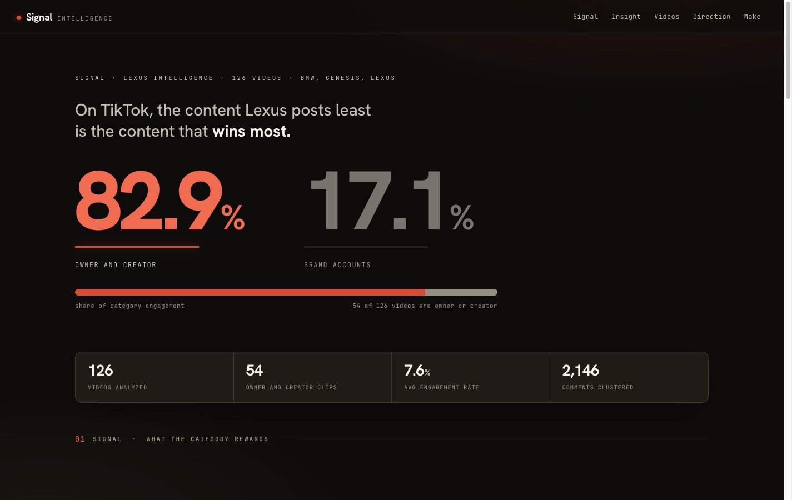
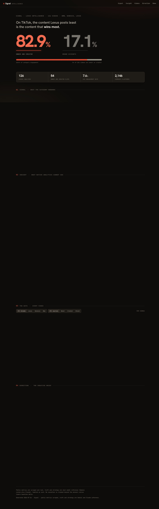
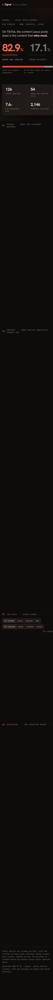

# TikTok Viral Analyzer

**A closed-loop TikTok brand-signal pipeline.** Point it at a brand and its
competitors and it scrapes their TikTok output, analyzes every video with
**Gemini Vision**, layers a **Claude** strategic read on top, distills *what is
actually winning* into a single signal, and then **generates the next shot to
make** — closing the loop from *sense → make → measure*.

It began as a per-video "why did this go viral" analyzer and grew into a
competitive brand-signal system with its own contract, dashboard, and
generation step.



## Worked example (real run)

The repo ships a **real run** as proof it works end to end — a competitive
teardown of **Lexus** against **Genesis** and **BMW** on TikTok:

- **126 videos** ingested and analyzed
- **~2,150 real comments** scraped and clustered into an "audience voice"
- **dual-model** active (Gemini for craft, Claude for strategy)
- owner/creator content vs brand content share, winning-pattern deltas,
  brand-fit gap, and creator-origin geolocation
- rendered as a self-contained **dark analyst dashboard** (`web/index.html`)

The committed `signal.json`, `data/analysis.json` and the dashboard are the
actual output of that run.




## How the pipeline works

```
brand + competitors + hashtags
        │
        ▼
  ingest.py       → Apify: scrape profiles, hashtag content, comments (batched);
                    top-vs-bottom engagement baseline
        │
        ▼
  analyze.py      → Gemini Vision per-video (craft) + Claude (strategy / brief);
  analyzer.py       brand-fit score (5 heuristics). Claude optional → authored fallback
        │
        ▼
  build_signal.py → winning patterns, baseline delta (winners vs losers),
                    owners-vs-brand, brand gap, audience voice (comment clustering)
        │
        ▼
  signal.json ──┬─→ web/index.html   (dashboard: fetches signal.json + videos.json)
                └─→ make_prompt.py    (closed loop: generate the next cinematic shot-prompt)
```

- **`geo_scrape.py`** adds creator-origin geolocation (honestly labelled as
  creator origin, not audience).
- **`docs/signal.schema.json`** + **`docs/contracts.md`** define the signal
  contract; the test suite validates against it.

## Any brand, not one brand

Nothing in the Python or the markup names a brand. The subject, its
competitors, their handles and hashtags, and the **brand brief** all come from
a config file:

```bash
cp config/TEMPLATE.json config/brand.json     # fill in subject + competitors
cp config/TEMPLATE-brief.md config/yourbrand-brief.md
```

The brief is the contract every `brand_fit` score answers to, and the tooling
refuses to run while it still reads like the template: an unwritten rubric
produces numbers that look authoritative and mean nothing.
`config/lexus.json` and `config/patagonia.json` are worked examples.

Three ways in:

- **`python3 gui_server.py`** — a local panel in the browser: one field takes a
  brand name or URL and derives the whole setup (competitors, handles searched
  and verified against TikTok, a draft brief), then runs the pipeline with live
  progress, a stop button, and archived past runs.
- **`python3 new_brand.py`** — the same flow as terminal prompts.
- The four stages by hand, `SIGNAL_BRAND_CONFIG=config/yourbrand.json`.

Every run archives the previous one under `archive/` before touching anything.

## Evolution over time

`timeline.py` scrapes a deep, **metadata only** pool of the subject's own
profile (a thousand posts cost cents), buckets posts by publish date, and
charts the account's trajectory: engagement rate, likes, comments and shares
per period, plus **audience sentiment** from a stratified comment sample scored
with a keyword and emoji lexicon. The dashboard renders it as an Evolution
section with the coverage and sample sizes stated on the page: the timeline
starts at the oldest post the scraper returns, and the sentiment is labeled
directional, not a survey.

```bash
python3 timeline.py --pool 1000 --comment-videos 40
```

## Tech

- **Python** pipeline, **HTML/CSS/JS vanilla** dashboard (no framework, no build step).
- Dependencies: `requests`, `python-dotenv`, `anthropic` (optional), `jsonschema`.
  Apify and Gemini are called over plain REST.
- **164 tests** (`pytest`), all green — ingest math, engagement tiering, the
  Gemini→craft mapping, graceful degradation with no videos/keys, schema
  validation, and the panel layer: config loading, run archiving, the sentiment
  lexicon and the timeline bucketing.

## Setup

```bash
pip install -r requirements.txt
cp .env.example .env      # then fill in your keys
```

Required keys: `APIFY_API_KEY`, `GEMINI_API_KEY`. `ANTHROPIC_API_KEY` is
optional — without it the strategic layer is authored deterministically and
flagged as such.

Run the stages in order (`ingest.py` → `analyze.py` → `build_signal.py` →
`build_videos_json.py`), then serve `web/` over http (the page fetches
`signal.json`, so `file://` will not work): `cd web && python3 -m http.server`.

## Tests

```bash
python -m pytest -q       # 164 passed
```

## License

MIT — see [LICENSE](LICENSE).
